<!DOCTYPE html>
<html lang="ru">
<head>
    <meta charset="UTF-8">
    <title>Энергос - Производство электроэнергии</title>
    <link href="https://fonts.googleapis.com/css2?family=Oswald:wght@400;500;700&display=swap" rel="stylesheet">
    
    
</head>
<body>

    

    

        <h3 id="site-name">Энергос</h3>
        <ul id="nav">
            <li><a href="#slide-home">Главная</a></li>
            <li><a href="#slide-goal">Цель</a></li>
            <li><a href="#slide-info">Общая информация</a></li>
            <li><a href="#slide-input">Входные компоненты</a></li>
            <li><a href="#slide-equip">Оборудование</a></li>
            <li><a href="#slide-ops">Технологические операции</a></li>
            <li><a href="#slide-output">Выход процесса</a></li>
            <li><a href="#slide-control">Управление и контроль</a></li>
        </ul>
    

    

        

            

                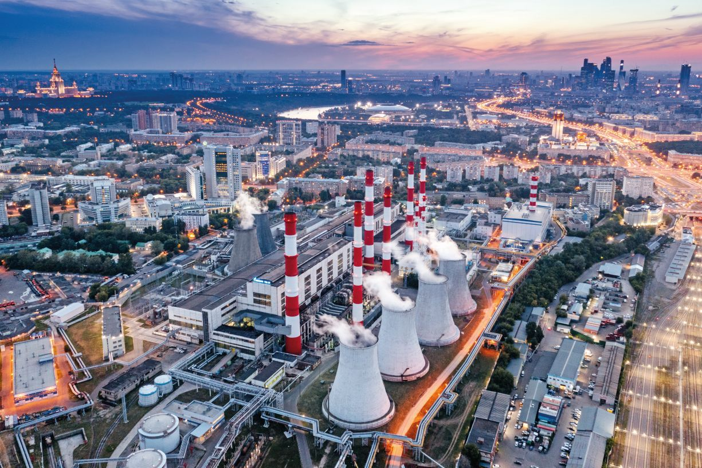
                <h1>АО «Энергос»</h1>
                
Пролистайте вправо →

            

            <section id="home-company-info">
                <h3>О компании</h3>
                
АО «Энергос» — один из крупнейших производителей электрической и тепловой энергии в регионе. Мы создаем фундамент для развития экономики.

                <ul id="company-stats">
                    <li><strong>15</strong>Электростанций</li>
                    <li><strong>10 000</strong>МВт Мощности</li>
                    <li><strong>5.2 Млн</strong>Потребителей</li>
                </ul>
                

                    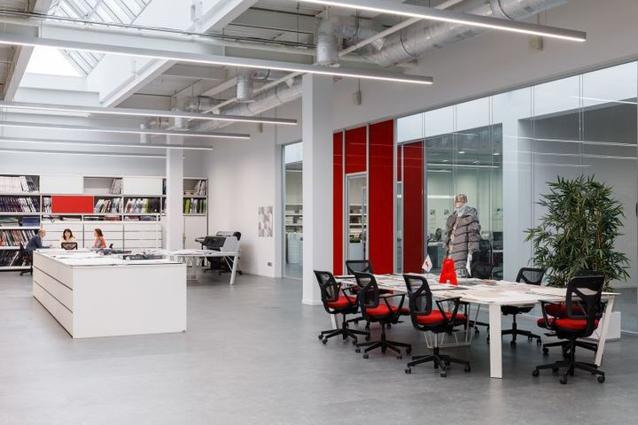
                    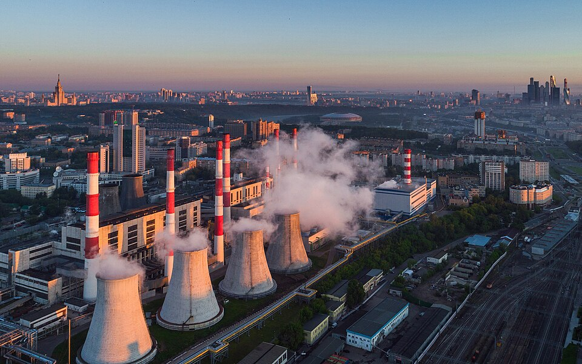
                    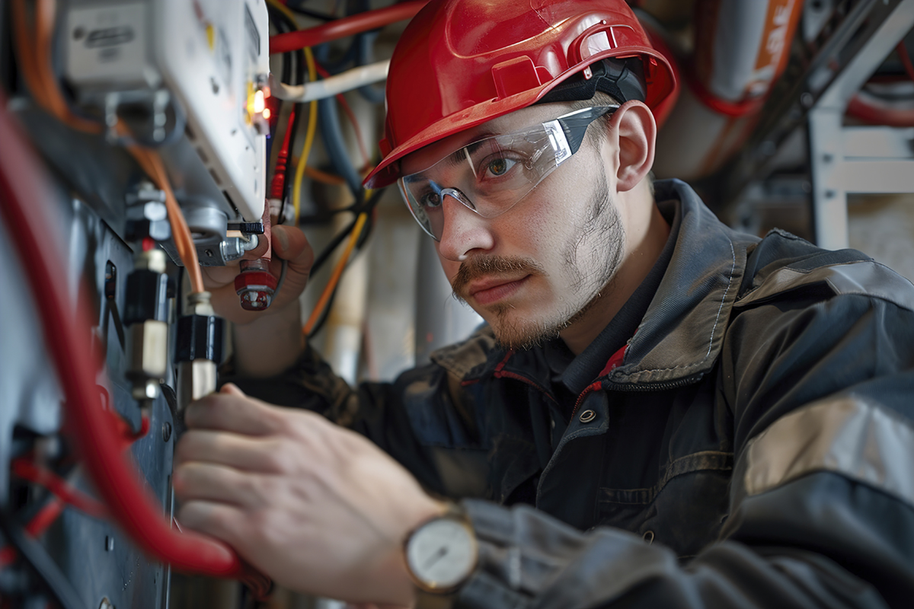
                

            </section>
        

        

            

                
                <h2>Цель проекта</h2>
            

            <section>
                <h3>Цель проекта</h3>
                
Изучить технологический процесс производства электроэнергии на тепловых электростанциях.

                

                    
▶ Раскрыть задачи проекта

                    
1. Проанализировать входные компоненты. 2. Изучить принцип работы оборудования. 3. Описать параметры выхода продукции. 4. Рассмотреть системы контроля.

                

            </section>
        

        

            

                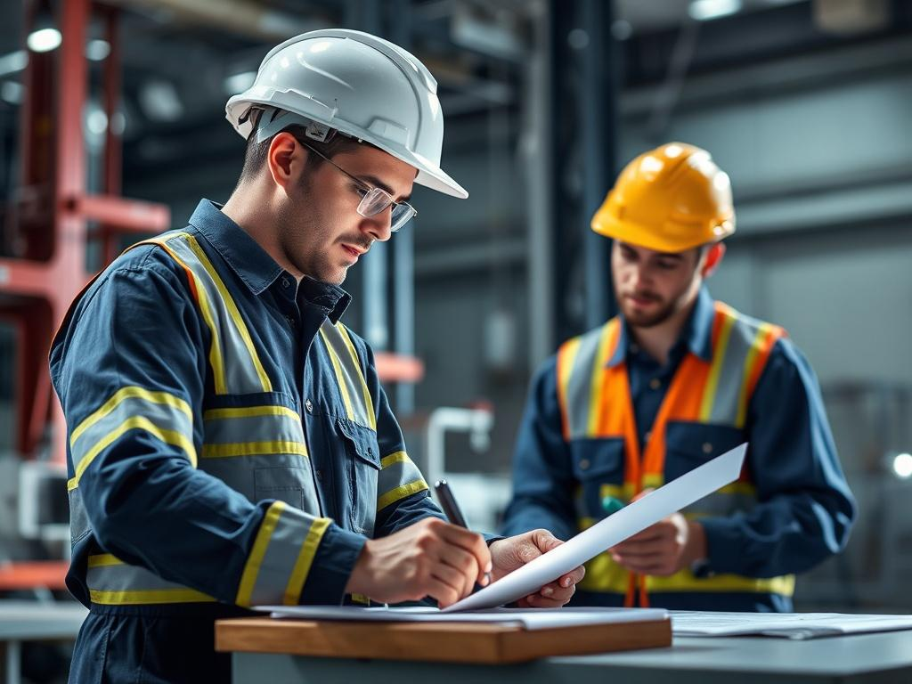
                <h2>Общая информация</h2>
            

            <section>
                <h3>Энергетика сегодня</h3>
                
Производство электроэнергии — это сложный процесс преобразования различных видов энергии. Структура выработки АО «Энергос» опирается на традиционные и возобновляемые источники.

                
                

                    

                        
Вещества

                    

                    <ul id="chart-legend">
                        <li>

Газ (60%)</li>
                        <li>

Уголь (25%)</li>
                        <li>

Гидро (15%)</li>
                    </ul>
                

                

                    
                    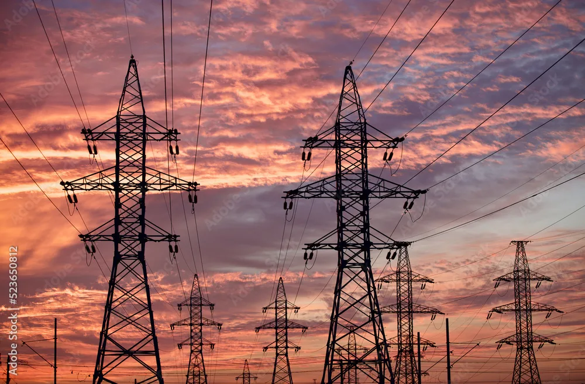
                    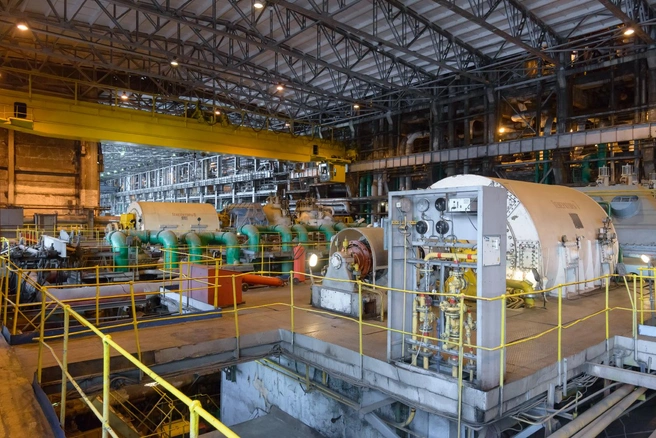
                

            </section>
        

        

            

                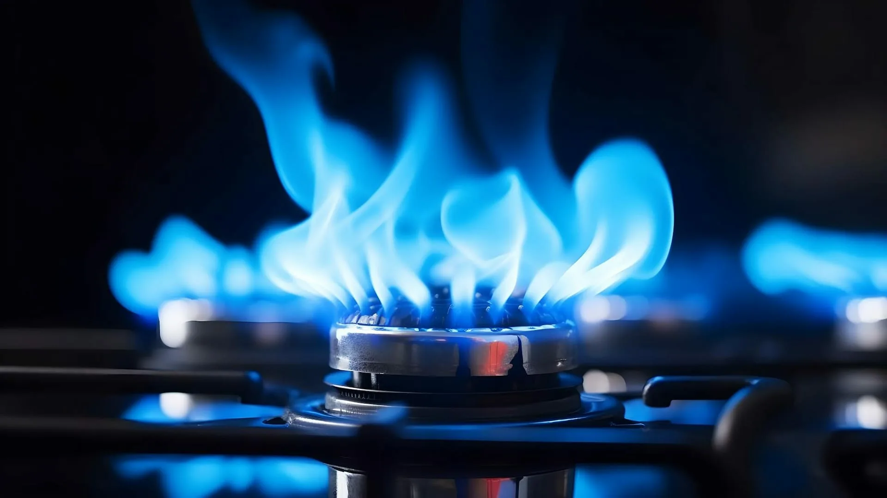
                <h2>Входные компоненты</h2>
            

            <section>
                <h3>Ресурсы для генерации</h3>
                
Для работы ТЭС требуются топливо, вода и воздух. Наведите курсор на карточку, чтобы узнать подробности.

                
                <!-- 3D Переворачивающиеся карточки -->
                

                    

                        

                            

                                <h4>Органическое топливо</h4>
                                
(Наведите курсор)

                            

                            

                                
Природный газ и уголь. Сгорают в топке, выделяя тепловую энергию.

                            

                        

                    

                    

                        

                            

                                <h4>Питательная вода</h4>
                                
(Наведите курсор)

                            

                            

                                
Проходит глубокую очистку. Нагревается до пара, который вращает турбину.

                            

                        

                    

                    

                        

                            

                                <h4>Атмосферный воздух</h4>
                                
(Наведите курсор)

                            

                            

                                
Необходим для процесса горения. Подается дутьевыми вентиляторами.

                            

                        

                    

                

            </section>
        

        

            

                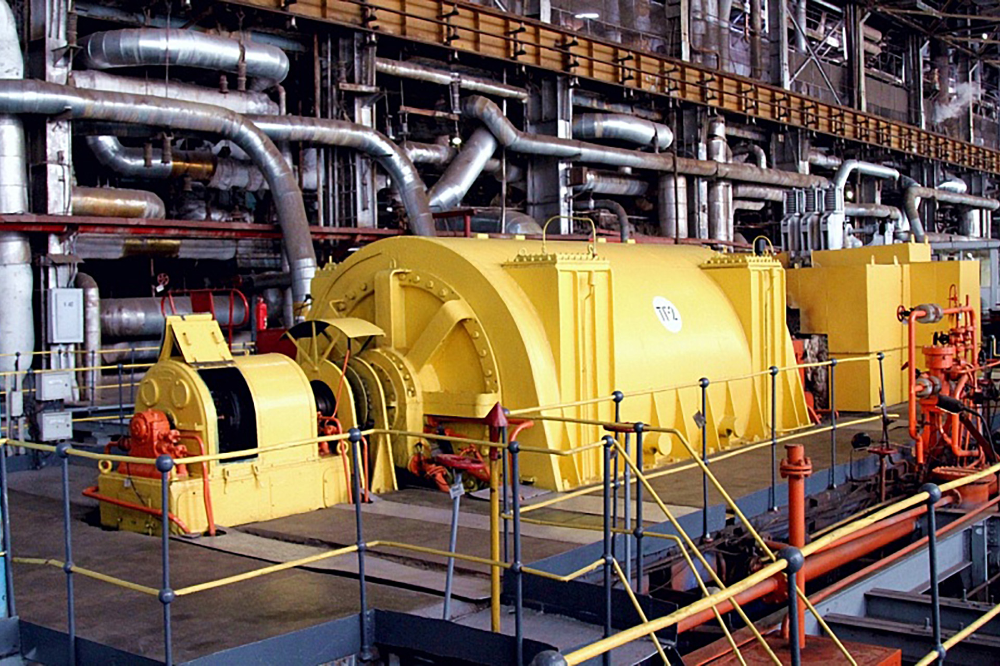
                <h2>Оборудование</h2>
            

            <section>
                <h3>Основные машины</h3>
                
                

                    
Паровой котел

                    
Устройство для получения пара высокого давления за счет сжигания топлива. Температура пара достигает 560°C.

                

                
                

                    
Паровая турбина

                    
Преобразует кинетическую энергию пара в механическую энергию вращения ротора.

                

                

                    
Турбогенератор

                    
Преобразует механическую энергию вала турбины в электрическую энергию переменного тока.

                

            </section>
        

        

            

                
                <h2>Технологические операции</h2>
            

            <section>
                <h3>Этапы процесса</h3>
                
                <ol id="steps-list">
                    <li>Подача топлива и воздуха в топку котла, процесс горения.</li>
                    <li>Нагрев питательной воды, превращение ее в пар.</li>
                    <li>Подача пара в турбину, вращение ротора.</li>
                    <li>Выработка электроэнергии в генераторе.</li>
                    <li>Охлаждение пара и возврат воды в котел.</li>
                </ol>
            </section>
        

        

            

                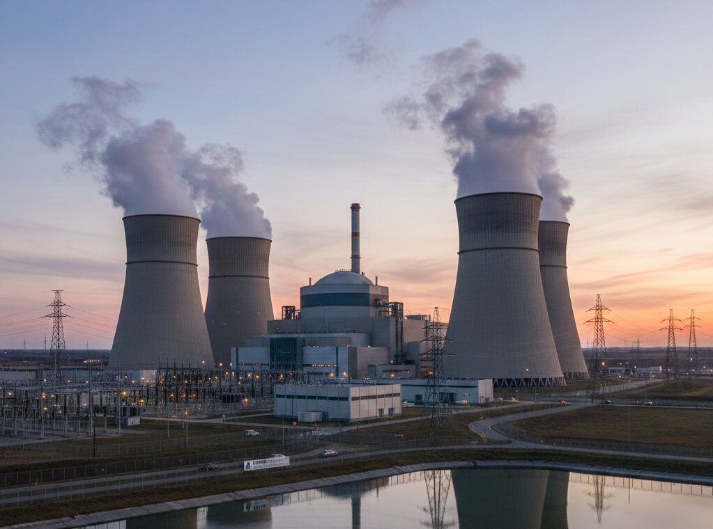
                <h2>Выход процесса</h2>
            

            <section>
                <h3>Результаты производства</h3>
                
                

                    <input type="radio" name="output-tabs" id="tab-radio-1" checked>
                    <input type="radio" name="output-tabs" id="tab-radio-2">
                    <input type="radio" name="output-tabs" id="tab-radio-3">
                    
                    <label for="tab-radio-1" id="tab-label-1">Электроэнергия</label>
                    <label for="tab-radio-2" id="tab-label-2">Тепловая энергия</label>
                    <label for="tab-radio-3" id="tab-label-3">Экология</label>
                    
                    

                        
Основной продукт. Вырабатывается на напряжении 10-20 кВ, затем повышается на подстанциях для передачи по ЛЭП. Частота в сети — 50 Гц.

                    

                    

                        
Побочный продукт ТЭЦ. Отработавший пар используется для нагрева сетевой воды, которая поступает в системы отопления городов.

                    

                    

                        
Дымовые газы проходят многоступенчатую очистку: золоуловители, десульфуризация, фильтры мелкодисперсной фракции.

                    

                

            </section>
        

        

            

                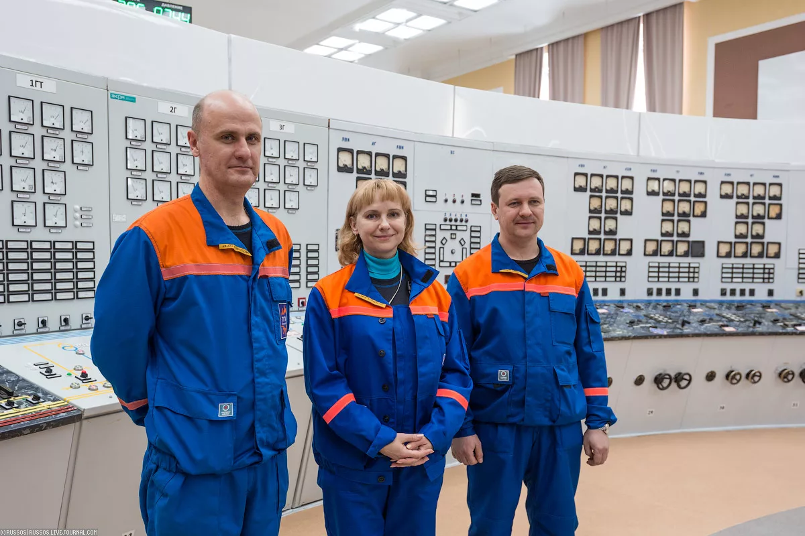
                <h2>Управление и контроль</h2>
            

            <section>
                <h3>АСУ ТП и безопасность</h3>
                
Управление станцией осуществляется с помощью автоматизированных систем.

                
                
⚠ Тест аварийной сигнализации

                

                    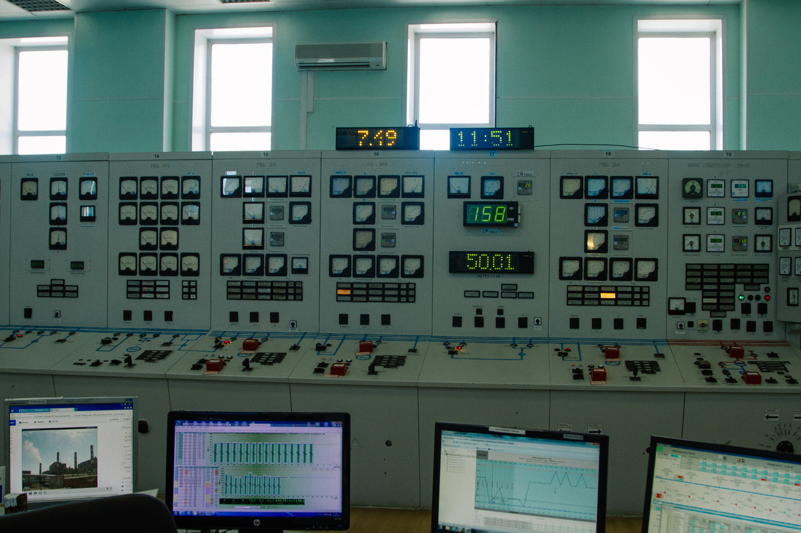
                    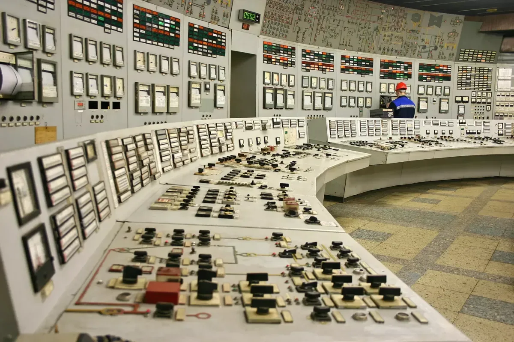
                    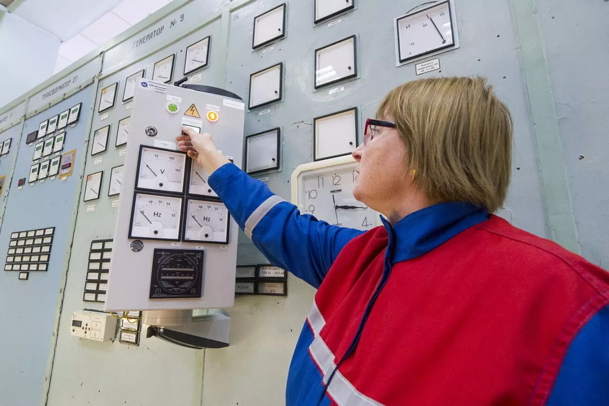
                

            </section>
            
            

                
Данные автора

                
Имя Фамилия: Арина Набаева

                
Email: arinanabaeva07@icloud.com

            

        

    

    <a href="#slide-home" id="go-top-btn">В начало ↑</a>

</body>
</html>
